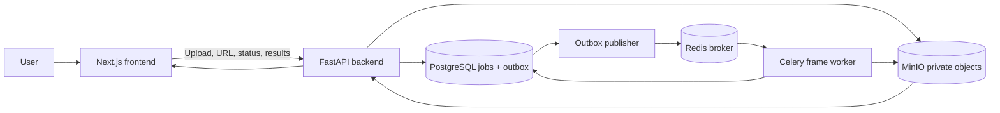
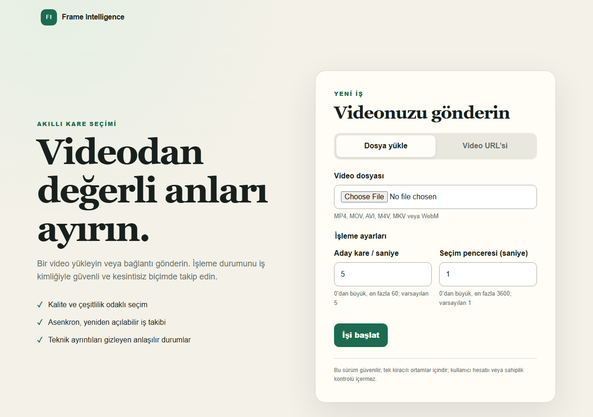
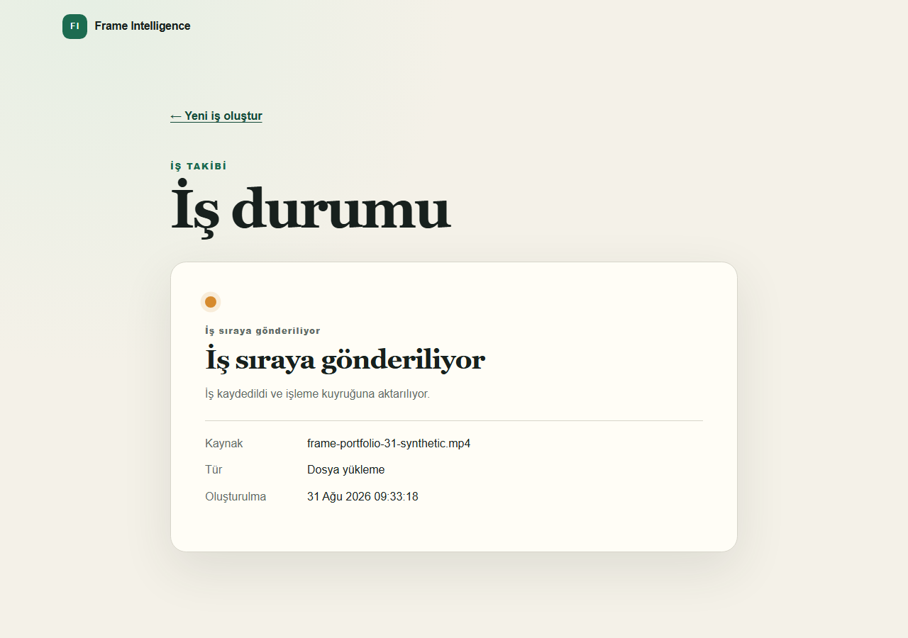

# Frame Intelligence Platform

Frame Intelligence Platform is an end-to-end video processing system that turns an uploaded video or supported video URL into a curated gallery of high-quality, non-duplicate frames. It combines a Next.js interface, an asynchronous FastAPI job API, PostgreSQL-backed job state, Redis/Celery dispatch, an optimized FFmpeg/OpenCV worker, and private S3-compatible artifact storage.

The repository is designed as a production-oriented portfolio project: request handling stays responsive, long-running work is recoverable, artifacts remain private, and the complete workflow is exercised by automated full-stack tests.

## The problem

Extracting useful frames from long videos is more than taking a screenshot every few seconds. A practical system must:

- accept large local uploads and remote video sources without blocking an HTTP request;
- select sharp, well-exposed, visually useful frames while avoiding near-duplicates;
- survive process restarts and transient infrastructure failures;
- keep source URLs, uploaded media, frames, and manifests out of public storage;
- expose understandable progress and results to a browser;
- run consistently in development, CI, and a single-host production deployment.

This project addresses that complete lifecycle rather than treating frame extraction as an isolated script.

## User flow

1. The user submits a local video file or a generic video URL from the web interface.
2. The backend validates the request, persists a job and transactional outbox event in PostgreSQL, and returns immediately.
3. The outbox publisher sends the job identifier to Redis; a Celery worker claims and processes the job.
4. URL sources are normalized to a local video, while uploads are retrieved from private object storage.
5. The frame worker streams candidate frames from FFmpeg and runs the quality-selection pipeline.
6. Selected JPEG frames and a versioned manifest are written to MinIO. The manifest is committed last.
7. PostgreSQL records the terminal job state, and the frontend displays status, metadata, and the result gallery.
8. Frame access is granted through short-lived, server-authorized URLs; internal object keys are not exposed as a public storage contract.

## Core capabilities

- Local video upload and generic URL job submission
- Idempotent asynchronous job creation and lifecycle tracking
- Transactional outbox dispatch to Redis/Celery
- Lease, heartbeat, retry, and stale-job recovery behavior
- FFmpeg raw-video streaming without temporary PNG extraction
- Sharpness/exposure scoring, shortlist motion reranking, SSIM duplicate detection, and classical enhancement
- Private S3-compatible source and result storage
- Versioned result manifests and browser result gallery
- Same-origin frontend API proxying in development and production
- Readiness/liveness probes, request IDs, structured logs, and rate limiting
- Development and production Docker Compose stacks
- Unit, integration, browser, full-stack, persistence, and backup/restore verification

## Architecture



In development, Compose exposes the frontend and backend directly. In production, Caddy is the public entry point and terminates HTTPS; PostgreSQL, Redis, MinIO, the backend, publisher, and worker remain on internal networks. A separate migration service applies Alembic migrations before application services start.

The key boundary is deliberate: `VideoProcessor` receives a ready local `Path`. Upload handling, URL resolution, downloading, storage access, and provider concerns live outside the frame-processing pipeline.

## Technology choices

| Technology | Role | Why it is used |
| --- | --- | --- |
| FastAPI | Job and result API | Typed asynchronous HTTP boundary with explicit validation and health endpoints |
| PostgreSQL | Durable jobs and outbox | Transactional lifecycle state, idempotency constraints, leases, and reliable dispatch intent |
| Redis | Celery broker and rate-limit state | Low-latency queue transport and shared ephemeral coordination |
| Celery | Background execution | Keeps video work outside the request lifecycle and supports retries and worker isolation |
| Frame Worker | Video analysis | Separates CPU-intensive FFmpeg/OpenCV processing from the API tier |
| MinIO | S3-compatible object storage | Private, durable source videos, frames, and manifests with a locally reproducible API |
| Next.js | Web application | Submission, live job tracking, and result-gallery experience behind one origin |
| Caddy | Production edge | HTTPS termination and routing without exposing internal services |
| Docker Compose | Runtime topology | Reproducible multi-service development, CI, and single-host production operation |

## Repository layout

```text
apps/
  backend/                 FastAPI job API, persistence, outbox, storage, migrations
  frontend/                Next.js submission, status, and result-gallery UI
services/
  frame-worker/            Celery orchestration and FFmpeg/OpenCV frame pipeline
deploy/                    Production validation, smoke, backup, and restore tooling
docs/                      Operational documentation
infrastructure/            Infrastructure-related project assets
ml/                        Reserved machine-learning workspace
tests/                     Repository-level test assets
compose.yaml               Development stack
compose.production.yaml    Single-host production stack
```

## Development setup

### Prerequisites

- Git
- Docker Engine or Docker Desktop with Docker Compose v2
- Enough disk space for container images, uploaded videos, and generated frames

Node.js 22+ and `uv` are only required when running frontend or Python checks directly on the host.

### Start the full stack

From the repository root:

```bash
cp .env.example .env
docker compose config --quiet
docker compose up --detach --build --wait
docker compose ps
```

Before startup, replace every required placeholder in `.env`, especially `JOB_SOURCE_ENCRYPTION_KEY`, with a newly generated secret. Do not commit `.env` or reuse example values in a deployed environment.

Open `http://localhost:3000`. The development services are available at:

| Service | Address |
| --- | --- |
| Frontend | `http://localhost:3000` |
| Backend API | `http://localhost:8000` |
| API documentation | `http://localhost:8000/docs` |
| MinIO console | `http://localhost:9001` |
| PostgreSQL | `localhost:5432` |
| Redis | `localhost:6379` |

Useful health checks:

```bash
curl --fail http://localhost:8000/api/v1/live
curl --fail http://localhost:8000/api/v1/ready
curl --fail http://localhost:3000/api/v1/ready
```

Stop the stack without deleting persistent volumes:

```bash
docker compose down
```

## Using the application

### Interface tour



The home screen keeps the source choice and processing controls in one focused submission form.



After upload, the status view follows the asynchronous job without exposing internal service or storage details.


A completed job presents the analysis summary and real frames selected from a small, explicitly synthetic test video.

### Upload a video

Select a local video on the home page and submit it. The browser uploads the source, then navigates to the job page. The UI polls the status API through the same-origin proxy until the job succeeds or fails.

The processing controls tune selection density rather than promise an exact output count:

- **Candidate frames per second** controls how densely frames are sampled from the video for analysis.
- **Selection window** is the approximate time interval from which one result is selected. A smaller window generally produces more results; a larger window generally produces fewer.

### Submit a video URL

Paste an HTTP or HTTPS video URL and submit it. A directly downloadable video address is the most reliable contract. The ingestion layer can also attempt supported platform addresses through its generic resolver, but provider support depends on upstream site behavior and is not a guarantee of YouTube or any other named service. Sources that require authentication, cookies, or DRM are intentionally rejected.

### Inspect results

The job page exposes the lifecycle (`PENDING_DISPATCH`, `QUEUED`, `RUNNING`, `SUCCEEDED`, or `FAILED`). Successful jobs link to a gallery backed by the public result-manifest contract. The API authorizes each frame request and issues short-lived access rather than making the object-storage bucket public.

Primary API routes:

| Method | Route | Purpose |
| --- | --- | --- |
| `POST` | `/api/v1/jobs/upload` | Submit an uploaded video |
| `POST` | `/api/v1/jobs/url` | Submit a generic video URL |
| `GET` | `/api/v1/jobs/{job_id}` | Read job status |
| `GET` | `/api/v1/jobs/{job_id}/result` | Read the result descriptor |
| `GET` | `/api/v1/jobs/{job_id}/result/manifest` | Read the public manifest |
| `POST` | `/api/v1/jobs/{job_id}/result/frames/{frame_index}/access` | Authorize temporary frame access |

Submission requests require an `Idempotency-Key`. Reusing the same key and payload returns the existing job; reusing it for a different payload is rejected.

## Tests and quality checks

The test suite is intentionally layered. Unit tests cover domain behavior in isolation; PostgreSQL/Redis/MinIO integration tests validate infrastructure contracts; Playwright covers browser behavior; the full-stack E2E creates a synthetic video, submits it through the UI, waits for worker completion, and verifies the resulting frame gallery and manifest. Production smoke tests additionally exercise proxy routing, persistence across service restarts, migrations, and backup/restore behavior.

### Backend

```bash
cd apps/backend
uv sync --locked --dev
uv run ruff check src tests
uv run ruff format --check src tests
uv run pytest
```

### Frame worker

```bash
cd services/frame-worker
uv sync --locked --dev
uv run ruff check src tests
uv run ruff format --check src tests
uv run pytest
```

### Frontend

```bash
cd apps/frontend
npm ci
npm run lint
npm run typecheck
npm test
npm run build
```

Browser and system suites require their documented services and environment to be available:

```bash
cd apps/frontend
npx playwright install chromium
npm run test:e2e
npm run test:proxy-integration
npm run test:full-stack-e2e
```

The GitHub Actions workflows under [`.github/workflows`](.github/workflows) are the executable reference for CI service setup and the complete validation matrix.

## Production deployment

The supported production target is a hardened single Ubuntu host running the pinned images in `compose.production.yaml`. Caddy is the only public service; application and data services communicate on internal Compose networks.

At a high level:

```bash
cp .env.production.example .env.production
sh deploy/scripts/validate-env.sh .env.production
docker compose --env-file .env.production -f compose.production.yaml config --quiet
docker compose --env-file .env.production -f compose.production.yaml up --detach
```

All placeholders in `.env.production` must be replaced with deployment-specific domains, image references, credentials, and encryption material before validation. Migrations run as a separate one-shot service with a PostgreSQL advisory lock; application containers do not create schemas at runtime.

For host preparation, DNS and HTTPS setup, exact rollout checks, diagnostics, rollback, and recovery procedures, follow [Production Operations](docs/production-operations.md).

## Security and observability

- Source URLs are encrypted at rest with AES-GCM and are never returned by the API.
- Idempotency fingerprints use keyed HMAC; URL credentials are rejected and sensitive query values are redacted from errors and logs.
- URL ingestion applies SSRF controls, redirect validation, timeouts, size limits, playlist rejection, and common video validation.
- Upload and result buckets are private. Public responses omit internal object keys and storage credentials.
- Result manifests are versioned, validated, and written last so incomplete artifact sets are not published as complete.
- API rate limiting uses Redis and fails closed for protected submission routes when shared limiter state is unavailable.
- Structured JSON logs include request/job correlation identifiers without logging raw source secrets.
- Liveness checks process health; readiness checks verify required dependencies such as PostgreSQL, Redis, and object storage.
- The production topology isolates data services from the public network and runs application containers with constrained runtime settings.

This is application-level defense in depth, not a claim of universal provider safety or DRM circumvention.

## Backup and restore

Production backup tooling captures PostgreSQL and MinIO data as one recovery set with checksums and metadata. Restore validation checks archive integrity and target safety before replacing state. Because job records and object artifacts form one logical result, they should be backed up and restored together.

The tested commands, retention guidance, restore drill, and disaster-recovery cautions are documented in [Production Operations: Backup and restore](docs/production-operations.md#backup-and-restore).

## Current limitations

- The documented production topology targets one host; multi-node orchestration and autoscaling are not implemented.
- Authentication, user accounts, and tenant isolation are not yet part of the public API.
- Authenticated/cookie-based media sources and DRM-protected sources are unsupported.
- Provider support depends on the generic ingestion adapter and upstream site behavior.
- Processing is CPU-oriented; GPU scheduling and learned ranking models are not part of the active pipeline.
- Storage retention and user-facing deletion workflows require deployment-specific policy.
- Large or adversarial media still requires operational resource limits and monitoring appropriate to the deployment.

## Portfolio engineering outcomes

This project demonstrates more than framework assembly. It includes:

- transactional job creation and outbox-based asynchronous dispatch;
- idempotency, concurrency constraints, leases, heartbeats, retry policy, and recovery semantics;
- a provider-independent source boundary that keeps network acquisition out of the core processor;
- measured frame-pipeline optimization, including FFmpeg stdout streaming and opt-in adaptive shortlisting;
- private artifact publication with versioned manifests and authorized access;
- a real browser-to-worker-to-gallery E2E path using generated test media;
- reproducible development and production topologies with migration, proxy, persistence, backup, and restore checks;
- security and observability controls treated as design requirements rather than release-time additions.

See [CONTRIBUTING.md](CONTRIBUTING.md) for contribution guidance. This project is licensed under the terms in [LICENSE](LICENSE).
